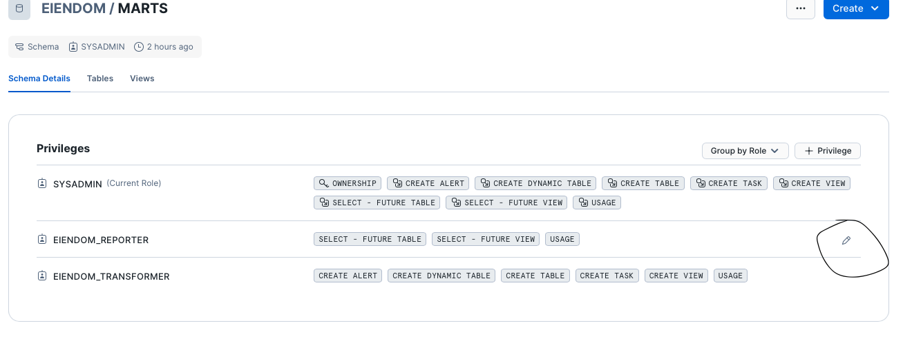
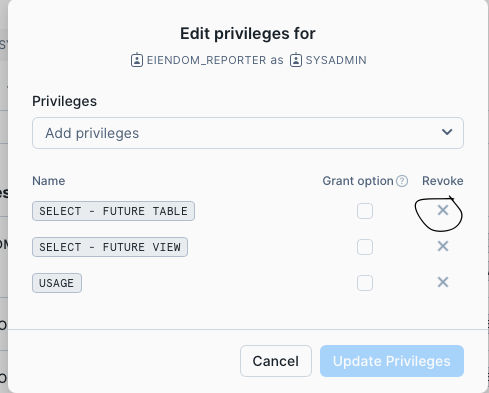

# Snowbird

Snowbird is a terraform / permifrost like program for managing snowflake resources and grants.

For documentation on how to use snowbird see [commands](./COMMANDS.md) or  use the command `snowbird --help` in the terminal.

## Installation

```shell
pip install "snowbird @ git+https://github.com/navikt/snowbird@<version>"
```

Example:

```shell
pip install "snowbird @ git+https://github.com/navikt/snowbird@v0.3"
```

## Upgrading

For upgrading to a new major or minor version, see installation

```shell
pip install --upgrade snowbird
```

## Release

Vi bruker [GitHub Release](https://docs.github.com/en/repositories/releasing-projects-on-github/managing-releases-in-a-repository) til versjonering. Versjonsnummereringen skal følge [semver](https://semver.org): `<major>.<minor>.<patch>` Eks: `0.1.0`. Siden vi enda ikke er på versjon 1 kan `minor` inkrementeres med 1 ved breaking changes i apiet og `patch` ved nye features eller bug fiks. Versjonsnr hentes fra [setup.py](setup.py)

Pass på at du har gjort følgende før du kjører `make release`:

* Koden er merget til `main`
* `version` i [setup.py](setup.py) er oppdatert. (Husk commit)

```shell
make release
```

## Migration

### Migrating to v0.3

#### Step 1

Take backup of existing databases. It's recommended to use the following naming standard:

```plain
<database name>_bck_<today's date>_drp_<some future month you want at least keep the backup>
```

Example:
```plain
my_database_raw__preprod_bck_20250404_drp_202506
```

The backup can be created with the [vdc clone](https://github.com/navikt/vdl-cli/blob/main/COMMANDS.md) command.

Example:
```
vdc clone my_database_raw__preprod my_database_raw__preprod_bck_20250404_drp_202506
```

#### Step 2

Migrate the `snowflake.yml`-file to the new schema. You can use [vdl-eiendom](https://github.com/navikt/vdl-eiendom/commit/247e4e97064f89f791301c99b41fc2056cd4aaeb) or [vdl-lonn](https://github.com/navikt/vdl-lonn/blob/main/infrastructure/snowflake.yml) for inspiration.

#### Step 3 (optional but recommended)

Snowbird is still only applying grants and not revoking them. Therefore it's recommended to revoke all grants on the databases and schemas to get a clean state. The easiest approach to do this is the following:

* Drop 'dbt-databases' (not raw-databases). Be carefull that you made the correct backups in step 1.
* Check that sysadmin is owner of raw-database and there schemas.
* Check correct ownership on tables
* Revoke all grants except from 'sysadmin' on the raw-databases and there schemas and tables.

Example on how to do this from the snowflake UI:




#### Step 4

Run the 'snowbird apply' command from the directory where the `snowflake.yml`-file lives:

```shell
snowbird apply
```

#### Step 5

Test that everything still works.
